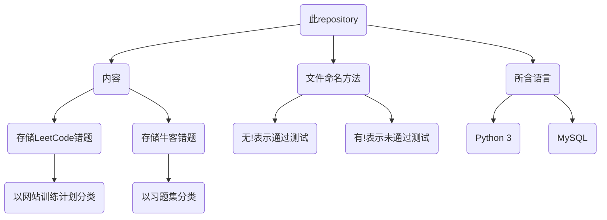

# code-exercise-corrections

   编程习题订正工作区

```mermaid
graph TD
rt(此repository) --> l1(内容)
rt --> l2(文件命名方法)
rt --> l3(所含语言)

l1 --> l11(存储LeetCode错题)
l1 --> l12(存储牛客错题)

l11 --> l111(以网站训练计划分类)
l12 --> l112(以习题集分类)

l2 --> l21(无!表示通过测试)
l2 --> l22(有!表示未通过测试)

l3 --> l31(Python 3)
l3 --> l32(MySQL)
```

  

